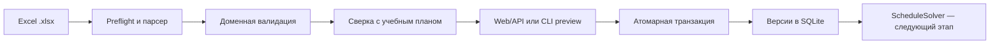

# College Auto Schedule

[](https://github.com/xelvhk/college_auto_schedule/actions/workflows/ci.yml)


Локальная система подготовки исходных данных и автоматического составления расписания колледжа. Проект строится как независимая реализация по нормативным требованиям, пользовательским сценариям и собственным приёмочным тестам: с прозрачными правилами и проверяемыми ограничениями.

Генератор расписания находится в разработке. Текущая версия предоставляет проверяемый Excel-импорт, сверку нагрузки с учебными планами и версионированное локальное хранилище.

## Ценность продукта

- Один источник данных для преподавателей, групп, нагрузки, специальностей, учебных планов и дисциплин.
- Предпросмотр и полный протокол ошибок до изменения рабочих данных.
- Атомарная активация: либо сохраняется весь согласованный пакет, либо активная версия не меняется.
- Проверка дисциплин, семестров, видов занятий и часов нагрузки по учебному плану группы.
- Локальная обработка персональных данных без обязательного облачного сервиса.
- Планируемая поставка как Windows-приложение с обычным установщиком и без отдельной установки Python.

## Основные сценарии

1. Методист заполняет или выгружает единый `.xlsx`.
2. Система безопасно читает шесть канонических листов и нормализует стабильные коды.
3. Предпросмотр показывает количество объектов, фрагменты данных, блокирующие ошибки и предупреждения по часам.
4. После подтверждения все разделы сохраняются в одной транзакции SQLite.
5. Оператор может просмотреть историю и вернуть ранее активную версию без повторного импорта.

## Что реализовано

- доменные модели преподавателей, групп, нагрузки, специальностей, учебных планов и дисциплин;
- канонические листы `Преподаватели`, `Группы`, `Нагрузка`, `Специальности`, `Учебные планы`, `Дисциплины`;
- проверка обязательных колонок, типов, диапазонов, дублей и ссылочной целостности;
- проверка применимости плана группы и соответствия нагрузки дисциплинам и часам плана;
- отклонение формул, макросов, внешних ссылок, вложенных объектов и подозрительных ZIP-контейнеров;
- двухфазный веб-процесс `предпросмотр → активация`;
- версионированное SQLite-хранилище, идемпотентность по SHA-256 и откат к прошлой версии;
- CLI для проверки, импорта, статуса и смены активной версии;
- CI на Linux и Windows с Python 3.12 и сборкой wheel.

## Технологический стек

| Область | Технологии |
|---|---|
| Домен и валидация | Python 3.12, Pydantic 2 |
| Excel | openpyxl, defusedxml |
| Web/API | FastAPI, Uvicorn, vanilla JavaScript |
| Хранилище | SQLite, транзакции и внешние ключи |
| Качество | unittest, GitHub Actions, wheel build |
| Планируемый решатель | OR-Tools CP-SAT за интерфейсом `ScheduleSolver` |

## Быстрый запуск

```bash
python3 -m venv .venv
.venv/bin/pip install -e .
.venv/bin/uvicorn rasp.web.app:app --host 127.0.0.1 --port 8000
```

Откройте `http://127.0.0.1:8000`. Путь к базе можно изменить переменной `RASP_DATABASE_PATH`; значение по умолчанию — `data/rasp.sqlite3`.

### CLI

```bash
rasp validate path/to/import.xlsx
rasp import path/to/import.xlsx --database data/rasp.sqlite3
rasp status --database data/rasp.sqlite3
rasp activate-version 1 --database data/rasp.sqlite3
```

Коды завершения: `0` — успех, `2` — ошибка Excel-валидации, `3` — ошибка хранилища, `4` — версия не найдена. Ответы выдаются в JSON; значения ячеек и полный путь к файлу не включаются в протокол ошибок.

## Контракт Excel

Новые три справочных листа добавляются только полным набором. Для совместимости поддерживается старый трёхлистовый файл без учебных планов; шестилистовый формат дополнительно включает:

- `Специальности` — код, название, квалификация, база и форма обучения;
- `Учебные планы` — специальность, год набора, редакция, период действия и статус;
- `Дисциплины` — дисциплина плана, семестр, вид занятия, контроль и плановые часы.

Подробные поля и правила описаны в [контракте справочных данных](docs/specs/reference-data-imports.md). Канонический синтетический пример хранится в `tests/fixtures/valid-import.xlsx`; реальные данные колледжа в репозиторий не добавляются.

## Архитектура



- `domain` не зависит от интерфейса и хранилища;
- `imports` преобразует недоверенный Excel в типизированный пакет;
- `application` координирует проверки готовности и активацию;
- `storage` хранит только полностью проверенные версии;
- `web` и `cli` являются тонкими входными адаптерами.

Целевой рабочий процесс описан в [функциональном benchmark](docs/research/timetable-functional-benchmark.md). Принципы независимой реализации зафиксированы в [ADR-002](docs/decisions/002-independent-functional-design.md).

## Безопасность и приватность

- Сервер по умолчанию работает только на loopback-адресе.
- Мутации с внешним `Origin` отклоняются; ответы защищены CSP, `X-Frame-Options`, `nosniff` и запретом кеширования.
- Реальные выгрузки колледжа должны находиться вне Git в `data/` или `imports/`.
- Для сетевой публикации потребуются отдельные аутентификация, HTTPS и настройка доверенного прокси.

## Roadmap

- [x] Безопасный импорт преподавателей, групп и нагрузки.
- [x] Специальности, учебные планы и дисциплины из Excel.
- [x] Предпросмотр, сверка часов и атомарная активация шести разделов.
- [ ] Студенты, подгруппы, корпуса и аудитории из Excel.
- [ ] Календарь и настраиваемые ограничения колледжа.
- [ ] Генератор расписания на OR-Tools CP-SAT и диагностика невозможности расчёта.
- [ ] Ручной редактор, версии расписания и экспорт Excel/PDF.
- [ ] Windows launcher, Inno Setup installer, обновление и release smoke-тесты.

Полный план и критерии приёмки: [docs/roadmap.md](docs/roadmap.md).

## Тестирование и CI

```bash
PYTHONPATH=src .venv/bin/python -m unittest discover -s tests -v
```

Все тестовые данные синтетические. GitHub Actions запускает тесты на Linux и Windows, проверяет зависимости и компиляцию, затем собирает wheel со статическими ресурсами.

## Статус

Проект находится на стадии `0.2 alpha`: импорт учебных планов готов, расчёт расписания ещё не реализован. Целевая поставка — устанавливаемое приложение для Windows 10/11 x64. Решение по поставке описано в [ADR-001](docs/decisions/001-windows-distribution.md).
